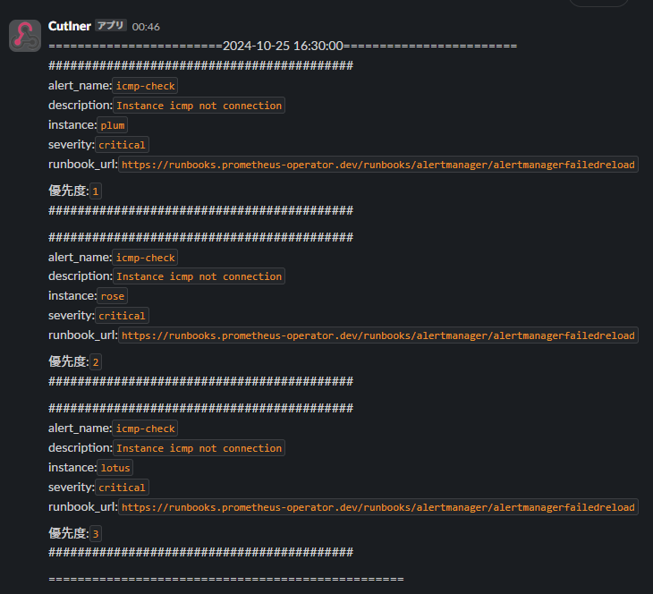

# CutIner
このソフトウェアは，私の所属する研究室の物理サーバにおいて，severityがcriticalのアラートが発生した時，そのアラートを取得して，アラート発生時刻の直前のVM使用時間をもとに優先度を設定します．そして，設定した優先度順にアラートを並び替え，アラートを送信します．

## get_alert.py
### 説明
このプログラムは，実行すると無限ループでAlertmanagerからのアラートを受け付け，取得します．
取得した後，severityがcriticalのアラートのみ，alertname，instance，severityの項目を抜き出して表示させることも行います．

### 使用方法

```
python3 get_alert.py
```

このコマンドでプログラムを実行できます．

アラートを取得するためには，Alertmanager側で以下のように設定を行う必要があります．

```
receivers:
- name: 'webhook-trouble-handler'
  webhook_configs:
    - url: 'http://<プログラムを実行するノードのIPアドレスまたはhostname>:9083'
      send_resolved: true

route:
  group_by:
  - severity
  group_interval: 1m
  group_wait: 30s
  receiver: "webhook-trouble-handler"
  repeat_interval: 1m
  routes:
  - match:
      alertname: DeadMansSwitch
    receiver: webhook-trouble-handler
  - continue: true
    match: null
    receiver: webhook-trouble-handler
```

### 実行結果
```アラート取得待機中
c0a21030@c0a21030-implement:~/develop2$ python3 get_alert.py 
2024-11-24 14:10:41 Starting server on port 9083
```

このように，receiverとしてwebhook-trouble-handlerを指定してください．
また，このプログラムを実行中のIPアドレスまたはhostnameを指定してください．
### バージョン
このプログラムはPython3.10.12のバージョンで作成しました．うまく動作しない場合はこのバージョンに合わせてみてください

## get_PS_access.py
このプログラムは，物理サーバごとに，物理サーバ内のVMが，アラート発生時刻の直前にどのくらいの時間使用されていたのかを取得します．

### 使用方法
get_alert.pyによって呼び出されます．
get_PS_acccess.py単体で実行したい場合は,以下のように実行出来ます
```
python3 get_PS_access.py
```

### 実行結果
```テスト実行の結果
c0a21030@c0a21030-implement:~/develop2$ python3 get_PS_access.py 
パターン3, 使用時間：15, 使用開始時刻：2024-10-25 15:13:00, 使用終了時刻：2024-10-25 23:05:00
アラート発生時刻：2024-10-25 16:30:00
{'c0a21099-website-1005': 0, 'c0a21134': 0, 'c0a21134-tool-setup': 0, 'c0a21030-monitoring-mp': 15, 'c0a21099-website-1006': 0, 'outside-prometheus-ww3': 0, 'c0a21147-swipe': 0, 'outside-prometheus-ww2': 0}
```

## calc_before_usage.py
このプログラムは，引数として受け取った物理サーバごとのVM使用時間のデータから，物理サーバごとの直前使用度を算出します．

### 使用方法
get_alert.pyによって呼び出されます．
calc_before_usage.py単体で実行したい場合は,以下のように実行出来ます
```
python3 calc_before_usage.py
```

### 実行結果
```テスト実行の結果
c0a21030@c0a21030-implement:~/develop2$ python3 calc_before_usage.py 
{'plum': Decimal('0.13'), 'rose': Decimal('0.08')}
```

## set_priority.py
このプログラムは，引数として受け取った物理サーバごとの直前使用度をもとに，優先度を割り当てます．

### 使用方法
get_alert.pyによって呼び出されます．
set_priority.py単体で実行したい場合は,以下のように実行出来ます
```
python3 set_priority.py
```

### 実行結果
```テスト実行の結果
c0a21030@c0a21030-implement:~/develop2$ python3 set_priority.py 
{'plum': 1, 'rose': 2, 'lotus': 3}
```

## push_alert.py
このプログラムは，引数として受け取った，Alertmanagerから取得したアラートの情報，物理サーバごとの優先度を使用して，優先度ごとに並び変えられたアラートを送信します．

### 使用方法
get_alert.pyによって呼び出されます．
push_alert.py単体で実行したい場合は,以下のように実行出来ます
```
python3 push_alert.py
```

### 実行結果
テスト実行の結果
